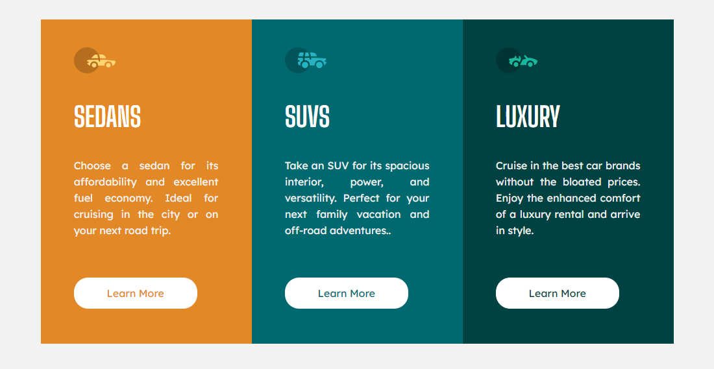

# Frontend Mentor - 3-column preview card component solution

This is a solution to the [3-column preview card component challenge on Frontend Mentor](https://www.frontendmentor.io/challenges/3column-preview-card-component-pH92eAR2-). Frontend Mentor challenges help you improve your coding skills by building realistic projects. 

## Table of contents

- [Overview](#overview)
  - [The challenge](#the-challenge)
  - [Screenshot](#screenshot)
  - [Links](#links)
- [My process](#my-process)
  - [Built with](#built-with)
  - [What I learned](#what-i-learned)
  - [Continued development](#continued-development)
  - [Useful resources](#useful-resources)
- [Author](#author)
- [Acknowledgments](#acknowledgments)

## Overview

the challenge was simple and good for learning how to better use the grid, which was the main focus of the challenge.

### The challenge

The main focus of the challenge was flexbox, grid and responsive.

### Screenshot

#### Desktop

#### Mobile

### Links

- Live Site URL: [Access Website](https://ericrdgs.github.io/Column-Preview-Card/)

## My process

First I created the html structure with main, then the section and the divs to be the cards, then I inserted the h2 tag, p and the images. After that I created a css reset, to remove margin and padding. I also created or css variables, where I put the colors I would use. Then I created the style, where I styled the html content and finally created the responsive css.

### Built with

- Semantic HTML5 markup
- CSS custom properties
- Flexbox
- CSS Grid

### What I learned

In this challenge I was able to learn and improve a little that I know about display grid, mainly in the part of the grid template collumn property, where I used the repeat function with auto-fit and minmax.

### Continued development

I want to keep learning and improving flexbox, also the grid and also make correct decisions when adding tags and css properties.

## Author

- Guthub - [My Github](https://github.com/EricRDGS)
- Frontend Mentor - [@EricRDGS](https://www.frontendmentor.io/profile/EricRDGS)

## Acknowledgments

I want to thank dev twice for the DevQuest course, without him I wouldn't be coding or doing a challenge. Very good teachers.
